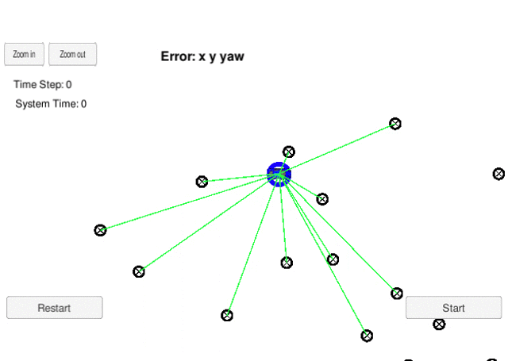
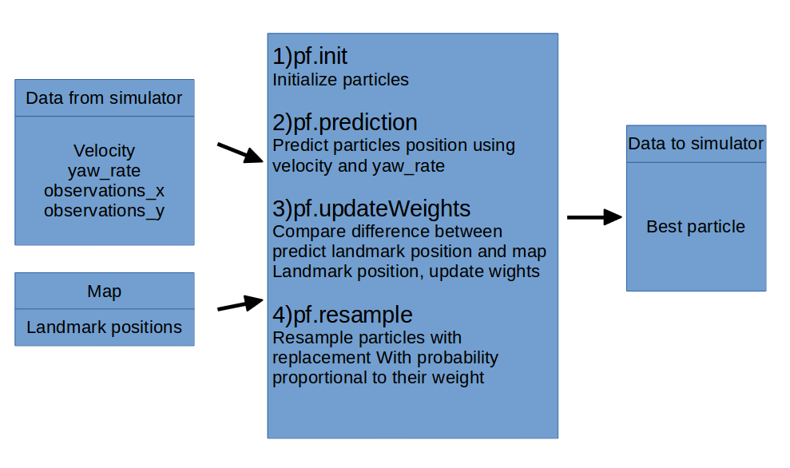
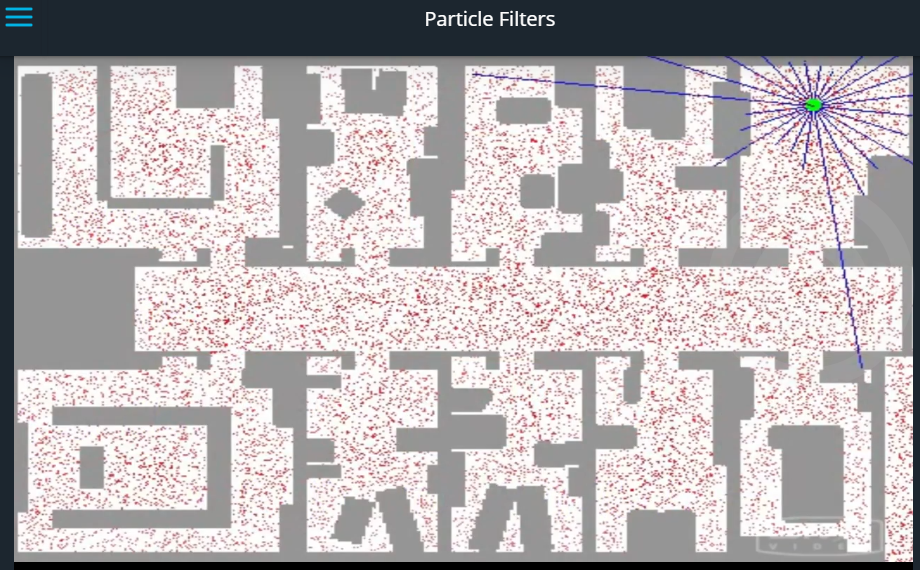
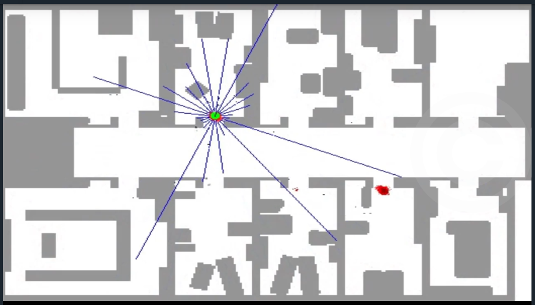
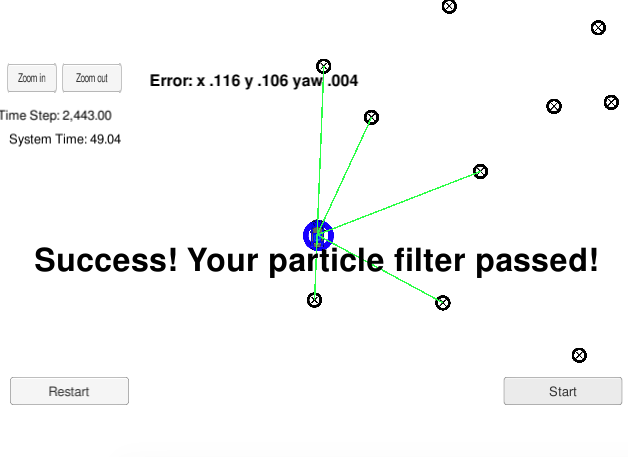

## Udacity CarND-Kidnapped-Vehicle-Project

####Zheng lei 2018 April
github repository:
https://github.com/lionzheng10/Localization_Kidnapped_vehicle

# Overview
This repository contains all the code needed to complete the final project for the Localization course in Udacity's Self-Driving Car Nanodegree.


## Project Introduction
Your robot has been kidnapped and transported to a new location! Luckily it has a map of this location, a (noisy) GPS estimate of its initial location, and lots of (noisy) sensor and control data.

In this project you will implement a 2 dimensional particle filter in C++. Your particle filter will be given a map and some initial localization information (analogous to what a GPS would provide). At each time step your filter will also get observation(landmark position in vehicle coordinate) and control data(velocity,yaw_rate). 



## Localization
The project is actually an **Localization** problem. Localization is mean find **WHERE I AM** in a map. 
What you know is:
- The map, which contains landmark's position in map coordinate (world coordinate)
- The initial position of the car(map coordinate)

In every cycle, you have these data(from simulator or from the real vehicle):
- The landmark's position from sensor(in vehicle coordinate)
- The control data, include velocity and yawrate of the car

What you want to calculate is:
- Where is the car in the map coordinate

## Data flow:


#### The Map
You can find `map_data.txt` in the `data` directory.  It includes the position of landmarks (in meters) on an arbitrary Cartesian coordinate system. Each row has three columns
1. x position
2. y position
3. landmark id

#### From simulator

```
 ["telemetry",{"sense_x":"7.1089","sense_y":"2.3117","sense_theta":"0.3050","previous_velocity":"3.9611","previous_yawrate":"3.0937","sense_observations_x":"3.7287 8.1344 -19.4559 -5.4781 6.5436 32.3996 -24.2259 19.6123 -42.1905 8.2219 -48.9066 ","sense_observations_y":"4.2655 -9.6414 3.4885 -22.1903 -25.7387 3.2385 -30.6744 -38.8006 -12.5755 -46.1126 0.4206 "}]

```

1. `sense_x`,`sense_y` position of the veichle in the world coordinate
2. `previous_velocity`,`previous_yawrate` velocity used for prediction
3. `sense_observations_x`,`sense_observations_y` observation data, position of landmarks in car coordinate

# What is Particle Filter
A particle is smart object, who can move and observe the enviroment. Imagine you have thousands of particles. At the beginning, these particles was randomly in the area. Like the picture below. The green dot is your robot, but now the robot did not know where it is.


Then the robot begin to move. Every particles moves in the same way. The particle observe the enviroment, especially the landmark position. And compute the diffrence between what he sensed and the map. If the difference is small, the particle survive. If the difference is large, the particle disappear. To keep the same amount of particles. We need realocate the particles depending on the difference. After sevral cycles, the particles will gathered around the robot. Like the picture below. Then we can use the best particle's positon as our robot's position.




# Implementing the Particle Filter
The directory structure of this repository is as follows:

```
root
|   build.sh
|   clean.sh
|   CMakeLists.txt
|   README.md
|   run.sh
|
|___data
|   |   
|   |   map_data.txt
|   
|   
|___src
    |   helper_functions.h
    |   main.cpp
    |   map.h
    |   particle_filter.cpp
    |   particle_filter.h
```


- ParticleFilter::init
  TODO: Set the number of particles. Initialize all particles to first position (based on estimates of x, y, theta and their uncertainties from GPS) and all weights to 1. Add random Gaussian noise to each particle.

- ParticleFilter::prediction
  TODO: Add measurements to each particle and add random Gaussian noise.
  
- ParticleFilter::dataAssociation
  TODO: Find the predicted measurement that is closest to each observed measurement and assign the observed measurement to this particular landmark.
  
- ParticleFilter::updateWeights
  TODO: Update the weights of each particle using a mult-variate Gaussian distribution.
  
- ParticleFilter::resample
  TODO: Resample particles with replacement with probability proportional to their weight. Big weight particles will increase, and small weight particles will delete.


## Running the Code
This project involves the Term 2 Simulator which can be downloaded [here](https://github.com/udacity/self-driving-car-sim/releases)

This repository includes two files that can be used to set up and intall uWebSocketIO for either Linux or Mac systems. For windows you can use either Docker, VMware, or even Windows 10 Bash on Ubuntu to install uWebSocketIO.

Once the install for uWebSocketIO is complete, the main program can be built and ran by doing the following from the project top directory.

1. mkdir build
2. cd build
3. cmake ..
4. make
5. ./particle_filter


## Success Criteria

The things the grading code is looking for are:


1. **Accuracy**: your particle filter should localize vehicle position and yaw to within the values specified in the parameters `max_translation_error` and `max_yaw_error` in `src/main.cpp`.

2. **Performance**: your particle filter should complete execution within the time of 100 seconds.

Your job is to build out the methods in `particle_filter.cpp` until the simulator output says:

```
Success! Your particle filter passed!
```
